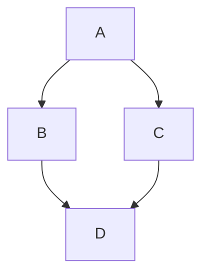

<table>
<colgroup>
<col style="width: 100%" />
</colgroup>
<tbody>
<tr>
<td style="text-align: left;">
<strong>Muslims Against pornography</strong>

<strong>Internal Team Document</strong>

<em>A Structured System for Behavior Change</em></td>
</tr>
</tbody>
</table>

|       |                  |
|:-----:|------------------|

# I Introduction

This framework document is created for the guided program offered by Muslims agains pornography (MAP). It captures the essential structure, decisions, and reasoning behind a new behavior-change system for recovery by systemizing the process. It is intended to serve as a foundational reference for the team building the program, meaning it is **only** internal.

For every system there are exceptions. Recovery is a bit complex and includes many inputs. The system we designed is designed to work with everyone if followed properly. However, not everyone will respond to it positievly. The system is not easy to follow. Recovery is a bit tricky. It requires Sabr and Jihad against oneself.

 Some people are not willing to take the hard decision, or simply they believe they can do it without the system. Great. If they can stop it on their own. That is amazing, we would be happy for them. We don\'t claim to be the only way. However it is important to draw lines. If one has decided to continue with us, you can only continue if you follow the system, otherwise what is the point?

 We are not there to help everyone, we are there to help who are willing to help themselves. 

|  |
|----|
| **Core Belief of why most people fail to stop:** 
1. Their system is weak or undefined.
 2. They overestimate the role of Willpower.

|  |  |  |  |  |  |  |  |  |  |  |  |  |  |
|----|----|----|----|----|----|----|----|----|----|----|----|----|----|

# II  The Problem(s)

Before defining the system that solves the problem.
We need first to understand the Problem. WE focus on countering one Problem instead of being unfocused on many and solve nothing. In our ideaology we target only one problem. We believe if that problem disappears you will be able to recover. 

**1.0 Extremely high availability:**

Other addictions have a clear boundary between the addictive substance and normal life. A recovering alcoholic doesn't walk past beer on every street corner. A recovering drug addict does not pass by a dealer once every few hours. But a person recovering from pornography addiction does. In every app, in every scroll, in every street. The trigger environment is inescapable in a way that is unique to this addiction. That means extremely high availability.

Unprecedented frictionless access. Any device, any moment, complete privacy, zero cost. It is as easy as breathing air.  No previous generation has faced this. The friction that historically acted as a natural brake, physical stores, cost, social exposure, has been entirely removed. All is available within your finger tips. 

**1.1 Social Media (explicit and implicit):**

Instagram, TikTok, Twitter/X — none of these were built to be pornography platforms, but all of them serve now sexually  explicit content, routinely, algorithmically, and without warning. Now prosititution workers use these platform to mmarket and advertise for their bodies as a product. Sex workers compete now on these platforms

Even if a person in recovery trying to scroll on Facebook to pass some time and see some memese encounters triggering content with on a Facebook story with no-opt out. The boundary between the addictive content and everyday life has effectively dissolved.

**1.2 Advertising :**

With  the growth of Western Capitalism, Womens' bodies are used to sell their products. Exactly as a shiny object. Dating apps, clothing brands, fitness products, entertainment, mainstream advertising has adopted increasingly sexualized imagery as standard practice. 

These appear on public screens, in apps, in YouTube pre-rolls, in the middle of articles. A person cannot use the internet for work, news, or communication without encountering this material. There is no clean space. Billboards, internet adds and in-App adds (in a Quran App believe it or not..)

**1.3 Netflix and co. :**

Beyond direct triggers, the broader sexual saturation of media plays an underrated role in the triggering cycle. Music videos, streaming series, animes, and mainstream films adds cumilative sexual triggering signal a person in recovery receives from their environment. The pop cultural environment is actively challengning the recovery system to stop.

# III  The Solution

Imagine a small shopping center that was struggling with frequent shoplifting. Store owners were frustrated and initially believed the only solution was to catch and punish more offenders. However, a crime prevention consultant suggested a different approach. Instead of focusing on the thieves themselves, the consultant examined the environment in which the thefts were occurring. Expensive items were moved closer to cash registers, security cameras were installed, mirrors were placed in blind spots, and clear signs warned customers that the premises were under surveillance. Within a few months, shoplifting incidents declined sharply.

 The change did not occur because potential offenders suddenly became more law-abiding; rather, stealing had become more difficult, riskier, and less rewarding. This example captures the central idea of **Situational Crime Prevention** (Clarke, 1980): crime can be prevented by reducing opportunities and altering environmental conditions that make offending attractive or easy. Rather than seeking to change the person, the approach focuses on modifying situations so that person's behavior becomes a less desirable choice.

As simple and as focused as possible. There is an extremely available content out there. You relapse because of the content. We eliminate the content availability. You have no content to relapse. You start your recovery process.

This is called **The killer of the 100 Principle.**

The killer of 100 in `The Hadth` when he went to ask the scholar whether his repentence is to be accepted, the first answer thing the scholar asked him to do is: `to leave his land and never comeback`. The first was a sacrifice of his comfortable enviroment. A change the he needed to make. An action. A complete Redesign of his surroundings. He asked him to join a people in a good land that worship Allah. He asked him to go look for a system that helps him and ditch his old enviroment that made hime the way he is now.

A system that elimnates **all** content access. It is like putting yourself in a desert, there is no way that you will get content here which leads to not relapsing to content. A `Change in an environment` that would contribute to an actial change.

|         |                                                   |
|:-------:|---------------------------------------------------|
# IV  The 3 Recovery Axes. 

|         |                                                   |
|:-------:|---------------------------------------------------|
# V  The Diagnostic Grid. 
Before our intervention, the grid must determine where the person actually is. The Knowledge--Action matrix provides a fast, reliable diagnostic. 

<table style="width:100%;">
<colgroup>
<col style="width: 14%" />
<col style="width: 37%" />
<col style="width: 37%" />
<col style="width: 10%" />
</colgroup>
<tbody>
<tr>
<td></td>
<td style="text-align: center;"><strong>Low Action</strong></td>
<td style="text-align: center;"><strong>High Action</strong></td>
<td></td>
</tr>
<tr>
<td style="text-align: center;"><strong>Low Knowledge</strong></td>
<td style="text-align: center;">
<strong>Quadrant A</strong>

<em><strong>Unaware</strong></em>

Doesn't understand the problem. Is not trying to quit.
</td>
<td style="text-align: center;">
<strong>Quadrant B</strong>

<em><strong>Try Hard, can't stop!</strong></em>

Lacks knowledge. Is still trying, sometimes coincidentally succeeds. 
</td>
<td></td>
</tr>
<tr>
<td style="text-align: center;"><strong>High Knowledge</strong></td>
<td style="text-align: center;">
<strong>Quadrant C</strong>

<em><strong>Stuck Struggler</strong></em>

Knows what to do, doesn't want to take a step. 
</td>
<td style="text-align: center;">
<strong>Quadrant D</strong>

<em><strong>Stable Recovery</strong></em>

Understands AND has systems in place. The Goal Quadrant 
</td>
<td></td>
</tr>
</tbody>
</table>

|  |
|----|
| ---------------------------------------------------------------------------------- |

**How to Navigate the Grid:** We are not trying to help everyone, we can only help those who want to help themselves.

1.  `Quadrant B` is our main target group. This who are trying to stop but can't or don't know how. As a rule `Action` is preferred over `Knowledge`. High `Action` says that you are atleast trying.

2. `Quadrant A` Rank 2 as priority, it is assumed that when they understand the problem they might start taking action. Though since they are not trying to stop, they are not actively looking around for solutions. i.e. they are not to be found on subreddits 

3. `Quadrant C` is  to be avoided. They are usually time wasters/attention seekers. Somone who knows what to do but comes up with excuses or simply don't want to make any sacrifice. They will seem that they need help but once you give them the hard solution you will see excuses floatig around. Once you identify a person identiy as `Quadrant C` it is better to not waste your time with him. As a last filter you give a strong warning by reminding him of Allah's punishment and and that you provided them a solution. They will be asked about this incident. 
