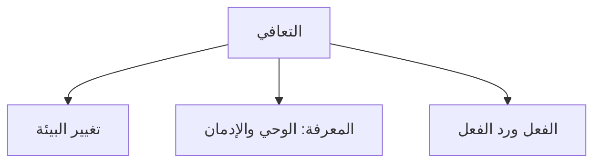
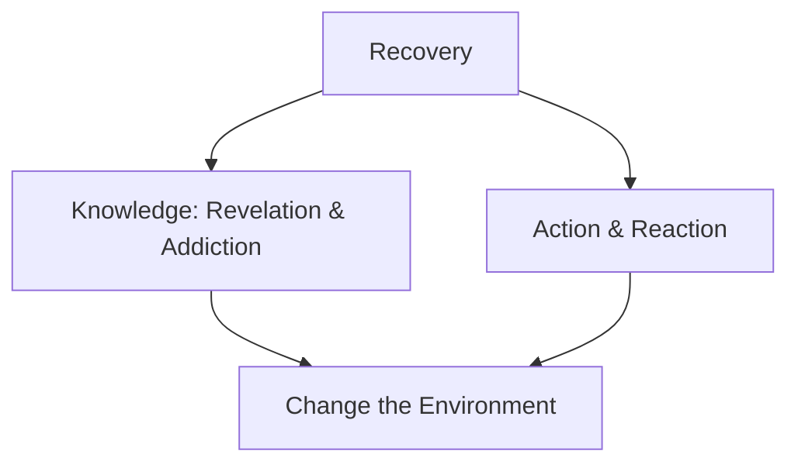

<table>
<colgroup>
<col style="width: 100%" />
</colgroup>
<tbody>
<tr>
<td style="text-align: left;">
<strong>مسلمون ضد الاباحية</strong>

<strong>المقدمة</strong>

</td>
</tr>
</tbody>
</table>

|       |                  |
|:-----:|------------------|

# أولا: المقدمة

تم إعداد هذه الوثيقة الإطارية للبرنامج الإرشادي الذي تقدمه منظمة "مسلمون ضد الإباحية" (MAP). وهي تُجسد البنية الأساسية والقرارات والأسس المنطقية لنظام جديد لتغيير السلوك بهدف التعافي من خلال تنظيم العملية. وتهدف هذه الوثيقة إلى أن تكون مرجعًا أساسيًا للفريق القائم على بناء البرنامج، أي أنها للاستخدام الداخلي فقط.

لكل نظام استثناءات. فالتعافي عملية معقدة نوعًا ما وتتضمن العديد من المدخلات. النظام الذي صممناه مصمم ليتناسب مع الجميع إذا تم اتباعه بشكل صحيح. ومع ذلك، لن يستجيب له الجميع بشكل إيجابي. فالنظام ليس سهل التطبيق. والتعافي عملية دقيقة نوعًا ما، تتطلب صبرًا وجهادًا ضد الذات.

بعض الناس غير مستعدين لاتخاذ القرار الصعب، أو يعتقدون ببساطة أنهم قادرون على التعافي بدون النظام. وهذا أمر رائع. إذا استطاعوا التوقف بمفردهم، فهذا إنجاز عظيم، وسنكون سعداء لأجلهم. نحن لا ندعي أننا السبيل الوحيد. ولكن من المهم وضع حدود. إذا قرر شخص ما الاستمرار معنا، فلا يمكنه الاستمرار إلا إذا اتبع النظام، وإلا فما الفائدة؟

لسنا هنا لمساعدة الجميع، بل نحن هنا لمساعدة من يرغبون في مساعدة أنفسهم. 

|  |
|----|
| **المعتقد الأساسي الذي يفسر فشل معظم الناس في التوقف:** 
1. نظامهم ضعيف أو غير محدد.
 2. إنهم يبالغون في تقدير دور قوة الإرادة.

|  |  |  |  |  |  |  |  |  |  |  |  |  |  |
|----|----|----|----|----|----|----|----|----|----|----|----|----|----|

# ثانياً: المشاكل 

قبل تحديد النظام الذي يحل المشكلة، نحتاج أولاً إلى فهمها. نركز على معالجة مشكلة واحدة بدلاً من تشتيت جهودنا بمعالجة مشاكل متعددة دون حل أي منها. في منهجنا، نستهدف مشكلة واحدة فقط. ونؤمن بأنها إذا اختفت هذه المشكلة، فسنتمكن من التعافي.

**1.0 توافر عالٍ للغاية:**

تتميز أنواع الإدمان الأخرى بحدود واضحة بين المادة المُسببة للإدمان والحياة الطبيعية. فالمدمن المتعافي من الكحول لا يمرّ بجوار بائعي الجعة في كل زاوية شارع، والمدمن المتعافي من المخدرات لا يمرّ بجوار تاجر مخدرات كل بضع ساعات. أما الشخص المتعافي من إدمان المواد الإباحية، فيفعل ذلك. في كل تطبيق، وفي كل تصفح، وفي كل شارع. بيئة التحفيز لا مفر منها بطريقة فريدة لهذا الإدمان، ما يعني توفرها بشكل كبير للغاية.

وصول سلس غير مسبوق. أي جهاز، في أي وقت، خصوصية تامة، بدون تكلفة. الأمر سهل كالتنفس. لم يواجه أي جيل سابق هذا الوضع. لقد أُزيلت تمامًا العقبات التي كانت تُشكّل عائقًا طبيعيًا في الماضي، كالمتاجر المادية، والتكلفة، والتعرض الاجتماعي. كل شيء متاح بضغطة زر.

**1.1 وسائل التواصل الاجتماعي (الصريحة والضمنية):**

إنستغرام، تيك توك، تويتر/إكس - لم تُصمم أيٌّ من هذه المنصات لتكون منصات إباحية، لكنها جميعًا تُقدّم الآن محتوى جنسيًا صريحًا، بشكلٍ روتيني، وخوارزمي، ودون سابق إنذار. تستخدم العاملات في مجال الجنس هذه المنصات لتسويق أجسادهن والإعلان عنها كسلعة. وتتنافس العاملات في مجال الجنس الآن على هذه المنصات.

حتى لو كان شخصٌ يتعافى من الإدمان ويحاول تصفح فيسبوك لتمضية الوقت، ويشاهد بعض الصور الساخرة، فإنه يصادف محتوىً مُثيرًا للإدمان في قصة على فيسبوك دون إمكانية إلغاء الاشتراك. لقد تلاشت الحدود بين المحتوى المُسبب للإدمان والحياة اليومية بشكلٍ فعلي.

**1.2 الإعلان:**

مع نمو الرأسمالية الغربية، تُستغل أجساد النساء لترويج المنتجات، تمامًا كأداة دعائية براقة. تطبيقات المواعدة، ماركات الملابس، منتجات اللياقة البدنية، وسائل الترفيه، والإعلانات التجارية السائدة، كلها تبنت استخدام الصور الجنسية بشكل متزايد كممارسة شائعة.

تظهر هذه الصور على الشاشات العامة، وفي التطبيقات، وفي إعلانات يوتيوب التمهيدية، وفي منتصف المقالات. لا يستطيع المرء استخدام الإنترنت للعمل أو الأخبار أو التواصل دون أن يصادف هذه المواد. لا يوجد مكان خالٍ منها. لوحات الإعلانات، إعلانات الإنترنت، والإعلانات داخل التطبيقات (حتى في تطبيق القرآن، صدق أو لا تصدق!).

**1.3 نتفليكس وشركاؤها:**

إلى جانب المحفزات المباشرة، يلعب الانتشار الواسع للمحتوى الجنسي في وسائل الإعلام دورًا غير مُقدَّر في دورة التحفيز. تُضيف مقاطع الفيديو الموسيقية، والمسلسلات عبر الإنترنت، وأفلام الأنمي، والأفلام التجارية إشارات جنسية مُحفزة تراكمية يتلقاها الشخص المتعافي من بيئته. تُشكِّل البيئة الثقافية الشعبية تحديًا فعليًا لنظام التعافي لوقف هذا التحفيز.

# ثالثا: الحل

تخيل مركزًا تجاريًا صغيرًا يعاني من كثرة السرقات. شعر أصحاب المتاجر بالإحباط، واعتقدوا في البداية أن الحل الوحيد هو القبض على المزيد من المجرمين ومعاقبتهم. لكن أحد خبراء مكافحة الجريمة اقترح نهجًا مختلفًا. فبدلًا من التركيز على اللصوص أنفسهم، درس الخبير البيئة التي تحدث فيها السرقات. نُقلت البضائع الثمينة إلى أماكن أقرب من صناديق الدفع، ووُضعت كاميرات مراقبة، ووُضعت مرايا في الزوايا غير المرئية، ووُضعت لافتات واضحة تُنبه الزبائن إلى أن المكان مُراقب. وفي غضون بضعة أشهر، انخفضت حوادث السرقة بشكل حاد.

 لم يحدث التغيير لأن المجرمين المحتملين أصبحوا فجأة أكثر التزامًا بالقانون؛ بل لأن السرقة أصبحت أكثر صعوبة ومخاطرة وأقل جدوى. يجسد هذا المثال الفكرة الأساسية لنظرية **الوقاية الظرفية من الجريمة** (كلارك، 1980): يمكن منع الجريمة عن طريق تقليل الفرص وتغيير الظروف البيئية التي تجعل ارتكاب الجريمة جذابًا أو سهلًا. فبدلًا من السعي لتغيير الشخص، يركز هذا النهج على تعديل المواقف بحيث يصبح سلوك الشخص خيارًا أقل استحسانًا.

بكل بساطة وتركيز ممكن. يوجد كم هائل من المحتوى المتاح. أنت تنتكس بسبب هذا المحتوى. نحن نزيل هذا المحتوى المتاح. لن يكون لديك أي محتوى لتنتكس بسببه. تبدأ رحلة تعافيك.

يُطلق على هذا اسم **قاتل مبدأ المئة**.

في الحديث، عندما ذهب قاتل المئة إلى العالم ليسأله إن كانت توبته مقبولة، كان أول ما طلبه منه العالم: "أن يترك أرضه ولا يعود إليها". كان ذلك يعني التضحية ببيئته المريحة، وهو تغيير كان عليه القيام به، فعلٌ، إعادة تصميم كاملة لمحيطه. طلب ​​منه العالم أن ينضم إلى قوم في أرض طيبة يعبدون الله، وأن يبحث عن نظام يُجبره على تغيير نفسه، وأن "يُغير بيئته".

أن يكون في نظام يُلغي **كل** إمكانية الوصول إلى المحتوى، كأنه وضع نفسه في صحراء، فلا سبيل للحصول على محتوى يمنع الانتكاس قسرًا. إنه "تغيير في البيئة" يُسهم في تغيير حقيقي في المرء.

|         |                                                   |
|:-------:|---------------------------------------------------|
# رابعاً: محاور التعافي الثلاثة. 

|         |                                                   |
|:-------:|---------------------------------------------------|

المحاور الثلاثة هي كل ما تحتاجه لنظام التعافي الخاص بك. بصراحة، تبدو المحاور في الواقع على هذا النحو تقريبًا.

مع اعتبار المعرفة والعمل محورين أساسيين، فإن تغيير البيئة يتطلب معرفة ما يجب تغييره والعمل على ما يجب فعله. وقد طُرح مصطلح "تغيير البيئة" لتسليط الضوء على أهميته ووزنه في رحلة التعافي.

|         |                                                   |
|:-------:|---------------------------------------------------|
# خامسا: الشبكة التشخيصية.  
قبل تدخلنا، يجب أن تحدد الشبكة مكان وجود الشخص فعلياً. توفر مصفوفة المعرفة والفعل تشخيصاً سريعاً وموثوقاً.

<table style="width:100%;">
<colgroup>
<col style="width: 14%" />
<col style="width: 37%" />
<col style="width: 37%" />
<col style="width: 10%" />
</colgroup>
<tbody>
<tr>
<td></td>
<td style="text-align: center;"><strong>سعي منخفض</strong></td>
<td style="text-align: center;"><strong>سعي عالي</strong></td>
<td></td>
</tr>
<tr>
<td style="text-align: center;"><strong>معرفة منخفضة</strong></td>
<td style="text-align: center;">
<strong>الربع (أ)</strong>

<em><strong>غير واعي</strong></em>

لا يفهم المشكلة. لا يحاول التوقف
</td>
<td style="text-align: center;">
<strong>الربع (ب)</strong>

<em><strong>يحاول بشدة, لا يستطيع التوقف</strong></em>

يفتقر إلى المعرفة. لا يزال يحاول، وينجح أحياناً بالصدفة. 
</td>
<td></td>
</tr>
<tr>
<td style="text-align: center;"><strong>معرفة عالية</strong></td>
<td style="text-align: center;">
<strong>الربع (ج)</strong>

<em><strong>العالِم العاجز</strong></em>

يعرف ما يجب فعله، لكنه لا يريد أن يخطو خطوة واحدة. 
</td>
<td style="text-align: center;">
<strong>الربع (د)</strong>

<em><strong>تعافي مستقر</strong></em>

يفهم ولديه أنظمة فعّالة. مربع الهدف 
</td>
<td></td>
</tr>
</tbody>
</table>

|  |
|----|
| ---------------------------------------------------------------------------------- |

**كيفية التنقل في الشبكة:** نحن لا نحاول مساعدة الجميع، بل يمكننا فقط مساعدة أولئك الذين يريدون مساعدة أنفسهم.

1. الفئة المستهدفة الرئيسية هي "الربع ب". هؤلاء الأشخاص يحاولون التوقف لكنهم لا يستطيعون أو لا يعرفون كيف. وكقاعدة عامة، يُفضّل "العمل" على "المعرفة". فارتفاع مستوى "العمل" يدل على أنك على الأقل تحاول.

2. الفئة "أ"، المرتبة الثانية من حيث الأولوية، يُفترض أنهم عندما يفهمون المشكلة قد يبدأون باتخاذ إجراء. مع ذلك، ولأنهم لا يحاولون التوقف، فهم لا يبحثون بنشاط عن حلول. أي أنهم غير موجودين في المنتديات الفرعية.

3. يجب تجنب الفئة "ج". عادةً ما يكونون مضيعة للوقت/باحثين عن الاهتمام. شخص يعرف ما يجب فعله لكنه يختلق الأعذار أو ببساطة لا يريد تقديم أي تضحية. سيبدو أنهم بحاجة إلى مساعدة، ولكن بمجرد أن تقدم لهم الحل الصعب، سترى الأعذار تطفو في كل مكان. بمجرد تحديد شخص ينتمي إلى الفئة "ج"، من الأفضل عدم إضاعة وقتك معه. كإجراء أخير، توجه تحذيراً شديداً بتذكيره بعقاب الله، وأنك قدمت لهم حلاً. سيُسألون عن هذا الحادث.

